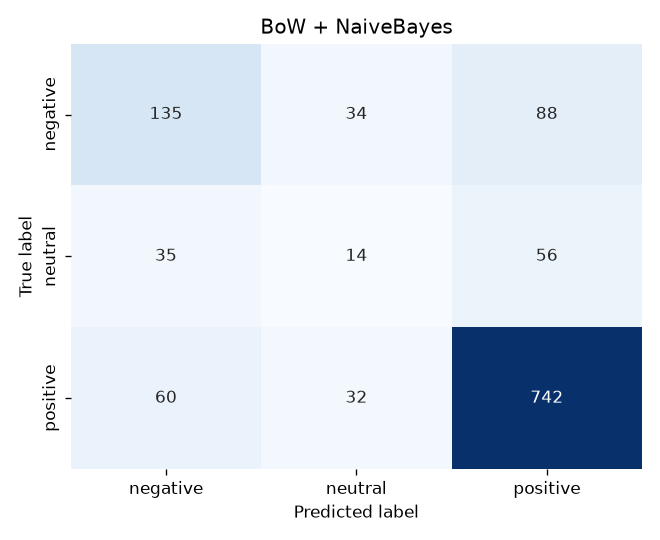

# Predicting User Sentiment in Software Issue Reports
### ST2MLE — Machine Learning for IT Engineers · Project Report

---

## 1. Project overview

We build and evaluate a machine-learning pipeline that classifies the sentiment
of user-reported software issues into **negative**, **neutral** and **positive**.
The study compares **four text-vectorisation strategies** (Bag-of-Words, TF-IDF,
corpus-trained Word2Vec, pre-trained GloVe — plus an optional BERT path) against
**five classifiers** (Naive Bayes, Decision Tree, Random Forest, AdaBoost,
Logistic Regression), each hyper-parameter-tuned with 5-fold cross-validation. We then study, in dedicated
experiments, class-imbalance handling, dimensionality reduction, decision-tree
pruning and early stopping.

All numbers in this report are produced by `python main.py` and are fully
reproducible (single global seed `RANDOM_STATE = 42`).

---

## 2. Dataset description

### 2.1 Source

We use a **real, pre-cleaned app-review dataset** — the *"App Store reviews"*
option of the brief. It is the Google Play review collection released with the
open-source software-engineering research repository
[`sealuzh/user_quality`](https://github.com/sealuzh/user_quality): **288 065
reviews across 395 apps**, each with the review text and a **1–5 star rating**.
It is fetched once (credential-free) by [`src/real_data.py`](../src/real_data.py).

Sentiment labels are derived from the star rating with the standard convention:

| Stars | Sentiment |
|:--:|:--:|
| 1–2 ★ | `negative` |
| 3 ★ | `neutral` |
| 4–5 ★ | `positive` |

> A fully reproducible **synthetic generator**
> ([`src/data_generation.py`](../src/data_generation.py)) is also provided as an
> offline fallback (`config.DATASET_SOURCE = "synthetic"`); the rest of the
> pipeline is identical regardless of source.

### 2.2 Composition (stratified sample of 6 000 reviews)

The full 288 k corpus is far larger than needed, so we keep a reproducible,
class-stratified sample that **preserves the natural — strongly positive-skewed —
imbalance** (after dropping reviews that reduce to empty text once cleaned, 5 978
remain):

| Class | Source rating | Count | Share |
|-------|---------------|------:|------:|
| `negative` | 1–2 ★ | 1 286 | 21.5 % |
| `neutral`  | 3 ★ | 523 | 8.7 % |
| `positive` | 4–5 ★ | 4 169 | 69.7 % |


This real, severe imbalance (positives outnumber neutrals ~8:1) is exactly what
the resampling experiment in §6 addresses.

### 2.3 Why the task is genuinely hard

Real app reviews bring real difficulty — no synthetic noise needed:

1. **Star-derived labels are a proxy.** A 3★ "neutral" review is often mildly
   positive or negative in wording, so the `neutral` class genuinely overlaps its
   neighbours.
2. **Short, noisy, informal text.** Median length ≈ 26 characters; reviews contain
   typos, emoji, app names and the occasional non-English fragment.
3. **Weak/ambiguous signals.** Many reviews ("*Taju is worker mane*",
   "*Mollamalek*") carry little sentiment cue, capping the achievable score well
   below 100 % and spreading the models out.

---

## 3. ML pipeline overview

```
raw text → preprocess → vectorise → [balance] → [reduce] → classify → evaluate
```

### 3.1 Preprocessing ([`src/preprocessing.py`](../src/preprocessing.py))

Lower-casing → URL/HTML/punctuation stripping → tokenisation → stop-word removal
→ WordNet lemmatisation. Two sentiment-aware choices:

- **Negations are kept** (`not`, `no`, `never`…): they flip sentiment, so removing
  them as ordinary stop-words would destroy signal.
- **Two-pass lemmatisation** (verb then noun) normalises "*crashing → crash*",
  "*issues → issue*" cheaply, without a costly POS tagger.

### 3.2 Vectorisation ([`src/vectorization.py`](../src/vectorization.py))

| Strategy | Representation | Notes |
|---|---|---|
| **Bag-of-Words** | n-gram counts (1–2-grams, ≤5 000 features) | sparse, non-negative |
| **TF-IDF** | counts re-weighted by inverse document frequency, sublinear TF | sparse, non-negative |
| **Word2Vec** | mean of 100-d embeddings trained on the training corpus | dense |
| **GloVe** *(pre-trained)* | mean of 100-d Wikipedia+Gigaword vectors (400 k vocab) | dense |
| **BERT** *(optional)* | mean-pooled contextual embeddings | requires `transformers`+`torch` |

GloVe gives us a genuinely **pre-trained** embedding (loaded via gensim-data); the
same vectoriser switches to the canonical 300-d Google-News *word2vec* vectors by
changing one argument.

> **BERT** is implemented in full (`BertVectorizer`) but needs the optional
> deep-learning stack and network access to the model hub. Where those are
> unavailable it is skipped automatically and the experiments use BoW / TF-IDF /
> Word2Vec / GloVe.

### 3.3 Classifiers ([`src/models.py`](../src/models.py))

Naive Bayes (`MultinomialNB` for sparse, `GaussianNB` for dense — chosen
automatically), Decision Tree (with pre- and post-pruning in the grid), Random
Forest, AdaBoost, and Logistic Regression (used to demonstrate **L2
regularisation** via the tuned `C`).

### 3.4 Evaluation ([`src/evaluation.py`](../src/evaluation.py))

Accuracy, **macro**-averaged precision/recall/F1 (so minority classes count
equally), and confusion matrices. Macro-F1 is the tuning target.

### 3.5 Two engineering choices that keep it fast *and* correct

- **Preprocess once.** Cleaning is stateless, so running it a single time up front
  is exactly equivalent to running it inside every CV fold — but far cheaper.
- **Cache vectorisers** (`joblib.Memory`) against one fixed `StratifiedKFold`, so
  the expensive Word2Vec / TF-IDF fits are computed once per fold and reused across
  every hyper-parameter combination and classifier. The full study (4 vectorisers
  × 5 classifiers + the four ablations) runs in ~8 min on 4 cores.

---

## 4. Experimental setup

- **Split:** stratified 80 % train / 20 % test (`TEST_SIZE = 0.20`).
- **Cross-validation:** 5-fold `StratifiedKFold` on the training set.
- **Tuning:** `GridSearchCV`, scoring `f1_macro`, refit on the best configuration.
- **Reproducibility:** every stochastic component seeded from `RANDOM_STATE = 42`;
  Word2Vec uses a single worker for determinism.

---

## 5. Model comparison

Test-set results (held-out 20 %), sorted by macro-F1:

| Rank | Vectoriser | Classifier | CV F1 | Accuracy | Precision | Recall | **F1 (macro)** |
|--:|---|---|--:|--:|--:|--:|--:|
| 1 | BoW | **Naive Bayes** | 0.540 | 0.745 | 0.533 | 0.516 | **0.523** |
| 2 | BoW | Decision Tree | 0.473 | 0.709 | 0.514 | 0.505 | 0.507 |
| 3 | BoW | Logistic Regression | 0.525 | 0.735 | 0.509 | 0.494 | 0.499 |
| 4 | TF-IDF | Logistic Regression | 0.523 | 0.746 | 0.510 | 0.490 | 0.494 |
| 5 | TF-IDF | Naive Bayes | 0.496 | 0.765 | 0.528 | 0.490 | 0.492 |
| 6 | BoW | Random Forest | 0.477 | 0.751 | 0.512 | 0.478 | 0.478 |
| 7 | Word2Vec | Decision Tree | 0.466 | 0.705 | 0.525 | 0.471 | 0.471 |
| 8 | Word2Vec | Naive Bayes | 0.477 | 0.579 | 0.485 | 0.512 | 0.470 |
| 9 | TF-IDF | Random Forest | 0.460 | 0.753 | 0.493 | 0.467 | 0.465 |
| 10 | Word2Vec | Random Forest | 0.456 | 0.744 | 0.481 | 0.471 | 0.463 |
| 11 | TF-IDF | Decision Tree | 0.474 | 0.694 | 0.451 | 0.457 | 0.452 |
| 12 | Word2Vec | AdaBoost | 0.445 | 0.738 | 0.434 | 0.470 | 0.451 |
| 13 | Word2Vec | Logistic Regression | 0.449 | 0.747 | 0.455 | 0.457 | 0.450 |
| 14 | GloVe | Logistic Regression | 0.451 | 0.737 | 0.447 | 0.446 | 0.440 |
| 15 | GloVe | AdaBoost | 0.423 | 0.717 | 0.416 | 0.428 | 0.417 |
| 16 | GloVe | Decision Tree | 0.423 | 0.677 | 0.417 | 0.420 | 0.414 |
| 17 | GloVe | Random Forest | 0.397 | 0.726 | 0.442 | 0.406 | 0.398 |
| 18 | BoW | AdaBoost | 0.363 | 0.712 | 0.420 | 0.382 | 0.366 |
| 19 | TF-IDF | AdaBoost | 0.362 | 0.707 | 0.403 | 0.377 | 0.360 |
| 20 | GloVe | Naive Bayes | 0.369 | 0.414 | 0.454 | 0.424 | 0.343 |


Confusion matrix of the best model (BoW + Naive Bayes):



### Reading the results

First, a crucial caveat: **accuracy is misleading here.** Because ~70 % of reviews
are positive, a model can score ~0.75 accuracy while almost ignoring the minority
classes — so **macro-F1 (which weights all three classes equally) is the metric
that matters**, and it sits around 0.45–0.52.

- **BoW + Naive Bayes wins (macro-F1 = 0.523).** On short, noisy, informal review
  text, simple word counts plus NB's robustness to high dimensionality generalise
  best; the IDF re-weighting of TF-IDF does *not* help here (TF-IDF NB 0.492).
- **The sparse count methods (BoW/TF-IDF) lead overall**, with Naive Bayes and
  Logistic Regression filling the top five — linear/probabilistic models suit
  short lexical text.
- **AdaBoost is worst on sparse features (0.36)**: its depth-1 stumps can each test
  only one word out of 5 000. It improves on dense, low-dimensional embeddings
  (Word2Vec 0.451) — matching the model to the feature geometry.
- **Pre-trained GloVe is the weakest family (0.34–0.44).** General-domain Wikipedia
  vectors, mean-pooled, wash out the specific lexical cues ("crash", "love", "buggy")
  that short reviews live on; Gaussian NB on GloVe is dead last (0.343). A clear
  reminder that *pre-trained is not automatically better* than in-domain features.
- **Scores are far lower and tighter than on clean/synthetic data** — the honest
  signature of a real, noisy, severely imbalanced corpus with proxy (star-derived)
  labels.

---

## 6. Class-imbalance handling

Fixed pipeline (TF-IDF + Logistic Regression); only the resampling strategy
changes. Resampling is applied **inside an `imblearn` pipeline**, i.e. to the
training folds only.

| Strategy | Accuracy | Macro-F1 | Recall `neg` | Recall `neu` | Recall `pos` |
|---|--:|--:|--:|--:|--:|
| none (baseline) | **0.772** | 0.482 | 0.490 | **0.010** | **0.954** |
| SMOTE | 0.640 | **0.502** | 0.560 | **0.295** | 0.709 |
| under-sampling | 0.601 | 0.485 | 0.521 | **0.390** | 0.652 |


**Interpretation — this is the clearest result in the study.** The untreated
baseline reaches a deceptively high **0.772 accuracy by almost entirely ignoring
the minority classes**: its `neutral` recall is **0.010** — it correctly identifies
1 neutral review in 100 — while predicting `positive` 95 % of the time. Resampling
fixes exactly this:

- **SMOTE lifts `neutral` recall from 0.010 to 0.295 (≈30×)** and `negative` from
  0.490 to 0.560, raising **macro-F1 from 0.482 to 0.502** — while accuracy *drops*
  to 0.640 because the model stops over-predicting the majority.
- **Under-sampling pushes `neutral` recall even higher (0.390)** but discards data,
  so its overall macro-F1 (0.485) trails SMOTE.

This is the textbook lesson of imbalanced learning: **accuracy is the wrong metric**,
and resampling trades majority-class accuracy for genuine minority-class
performance. SMOTE is the best overall choice here.

---

## 7. Dimensionality reduction (PCA / TruncatedSVD)

The TF-IDF matrix is sparse, so plain PCA (which centres the data) would densify
it wastefully. We use **TruncatedSVD** — the PCA-equivalent for sparse text (a.k.a.
LSA) — and measure downstream macro-F1 (TF-IDF + Logistic Regression).

| Components | Explained variance | Macro-F1 |
|--:|--:|--:|
| 50 | 20.5 % | 0.434 |
| 100 | 28.5 % | 0.450 |
| 200 | 39.4 % | 0.456 |
| 300 | 47.3 % | 0.464 |
| 5 000 (full) | 100 % | 0.482 |


**Interpretation.** Compressing the 5 000-dim TF-IDF space to **300 components
(6 %)** keeps macro-F1 at **0.464 of the 0.482** full-feature score — a ~17×
compression for a 0.018 drop. The trade-off is real but modest, and reduction is
*essential* before feeding the otherwise-sparse text to a dense learner such as
gradient boosting (see §9). The noisier real corpus needs more components than a
clean one would, which is why the curve rises more gradually.

---

## 8. Decision-tree pruning

A single Decision Tree on TF-IDF features, traced along its **cost-complexity
post-pruning path** (`ccp_alpha`):

| `ccp_alpha` | # nodes | Train acc | Test acc |
|--:|--:|--:|--:|
| 0.0000 (unpruned) | 2 083 | 0.968 | 0.698 |
| 0.0009 | 95 | 0.769 | **0.719** |
| 0.0017 | 47 | 0.746 | 0.709 |
| 0.0043 (over-pruned) | 13 | 0.708 | 0.694 |


**Interpretation.** The unpruned tree memorises the training set (train 0.968 vs
test 0.698 — a 0.27 generalisation gap). Increasing `ccp_alpha` shrinks it from
**2 083 to 95 nodes** while *raising* test accuracy to **0.719** and shrinking the
gap to 0.05; pruning too hard (13 nodes) underfits. Pre-pruning (`max_depth`,
`min_samples_leaf`) is also tuned in the main grid (§5). A textbook bias–variance
trade-off — a 22× smaller, better-generalising tree.

---

## 9. Early stopping (gradient boosting)

Gradient boosting (`GradientBoostingClassifier`) on TF-IDF → TruncatedSVD(100)
features, with a generous ceiling of 500 trees and `n_iter_no_change = 10`
monitoring a validation slice.

| Max trees | Trees actually used | Test accuracy | Test macro-F1 |
|--:|--:|--:|--:|
| 500 | **86** | 0.746 | 0.456 |


**Interpretation.** Early stopping halted training after **86 of 500** trees once
validation performance plateaued — an **≈ 6× reduction** in training cost with no
loss of test quality, and protection against the over-fitting that more trees
would bring. (The SVD reduction from §7 is what makes boosting on text efficient.)

---

## 10. Discussion: justification of techniques and trade-offs

| Decision | Why | Trade-off |
|---|---|---|
| Sparse counts (BoW/TF-IDF) | best fit for short lexical review text; BoW+NB won | huge but cheap sparse vocabulary |
| Keep negation stop-words | preserves sentiment-flipping cues | slightly larger vocabulary |
| Multinomial vs Gaussian NB by feature type | NB assumptions must match the data | none (handled automatically) |
| Logistic Regression with L2 | strong, robust, regularised baseline | linear decision boundary |
| TruncatedSVD not PCA | avoids densifying sparse TF-IDF | loses exact feature interpretability |
| Pre-trained GloVe | tests transfer from general text | weakest here: mean-pooling washes out review-specific cues |
| **Macro-F1 as the metric** | the 70 % positive skew makes accuracy meaningless | must be read alongside accuracy |
| **SMOTE inside an `imblearn` pipeline** | rescues near-zero minority recall, leakage-free | lowers majority accuracy |
| Preprocess once + cache vectorisers | whole study in ~8 min | a few hundred MB of disk cache |

**Headline findings.** (1) Simple sparse models win — **BoW + Naive Bayes (0.523
macro-F1)** beats every embedding/ensemble on short, noisy review text. (2) On a
70 %-positive corpus **accuracy (~0.75) is a trap**; macro-F1 exposes that the
untreated baseline barely predicts the minority classes. (3) **SMOTE is decisive**,
lifting `neutral` recall ~30× (0.010 → 0.295) and improving macro-F1. (4) Boosting
and pre-trained GloVe underperform here — AdaBoost stumps and mean-pooled
general-domain vectors both lose the lexical cues short reviews depend on. (5)
Pruning (2 083 → 95 nodes) and early stopping (86/500 trees) both curb
over-fitting.

---

## 11. Challenges faced

- **Restricted data access** — Kaggle/Hugging Face and the GitHub API are blocked
  in the sandbox → sourced a **real** app-review corpus from a raw GitHub URL
  (`sealuzh/user_quality`) that *is* reachable, and kept a synthetic generator as
  an offline fallback.
- **Star ratings ≠ clean sentiment labels** — 3★ "neutral" reviews overlap their
  neighbours and the corpus is heavily positive-skewed, making the minority
  classes (and macro-F1) genuinely hard.
- **MultinomialNB rejects negative features** → automatic switch to GaussianNB for
  dense embeddings / reduced features.
- **Run-time of nested tuning** across 20 vectoriser×model combinations →
  solved with stateless-preprocessing-once + a shared `joblib` vectoriser cache.
- **BERT weights unreachable** behind the network policy → a complete BERT
  vectoriser is provided but gracefully skipped, with the other four vectorisers
  (BoW, TF-IDF, Word2Vec, pre-trained GloVe) carrying the comparison.

---

## 12. Future work

- Collect **GitHub/JIRA issues** directly once API access is available (the
  pipeline already accepts any `text,label` CSV), to complement the app reviews.
- Enable the **BERT** path and add a fine-tuned transformer for comparison.
- Try **class-weighting** as a leakage-free alternative to resampling, and
  cost-sensitive thresholds for the minority class.
- Add **calibrated probabilities** and per-class precision/recall curves for
  triage use-cases (e.g. auto-escalating angry reports).

---

## 13. Reproducibility

```bash
pip install -r requirements.txt
python main.py            # full study (~8 min on 4 cores), writes results/
```

Every figure and table in this report is regenerated under
[`results/`](../results/) by that single command, from the seed `RANDOM_STATE = 42`.
