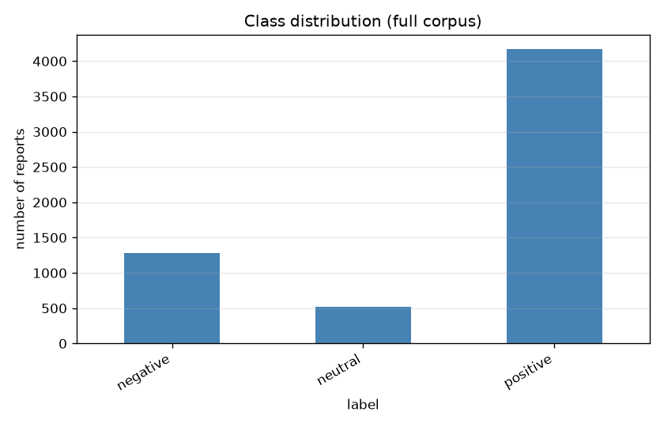
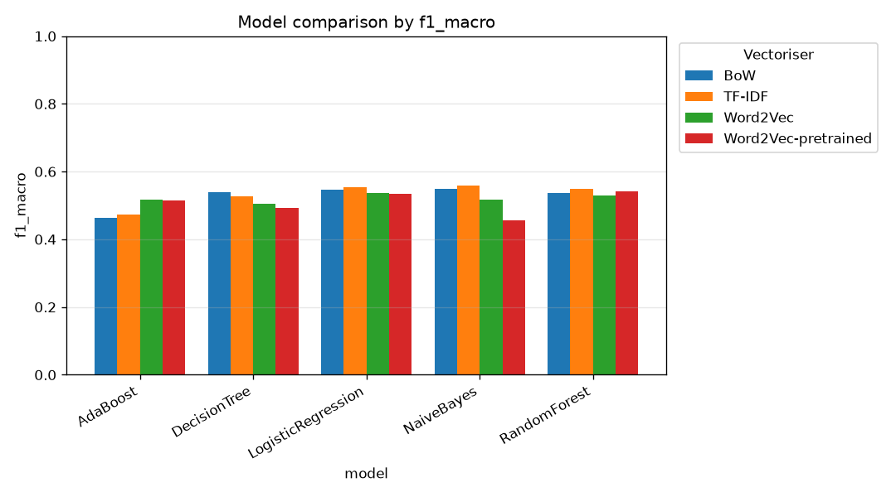
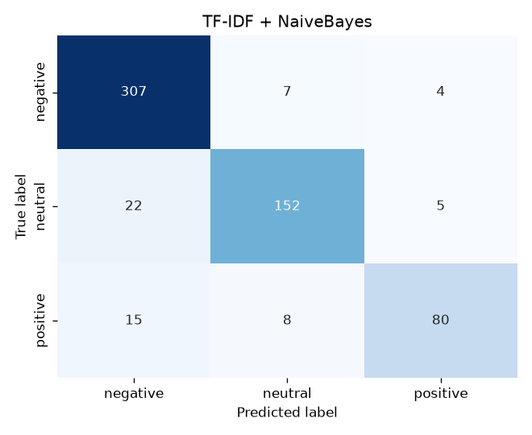
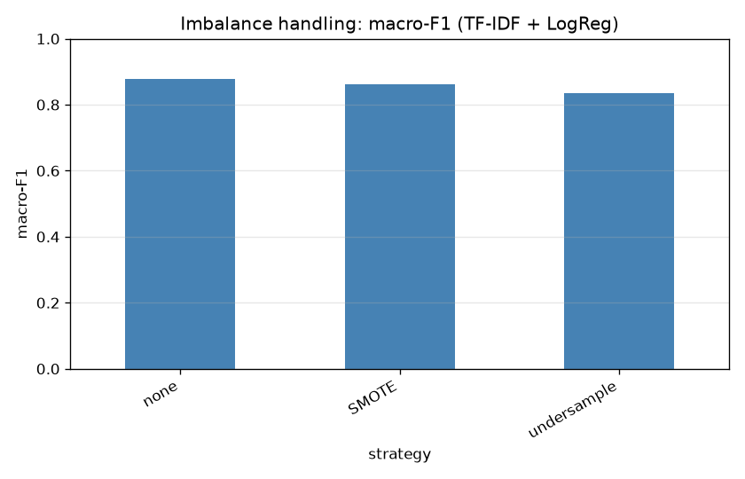
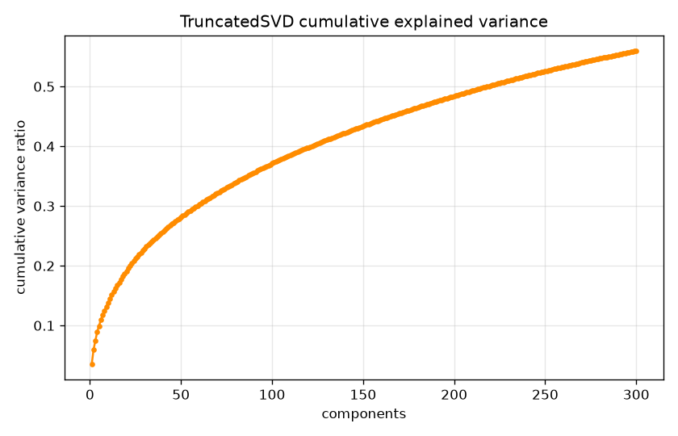
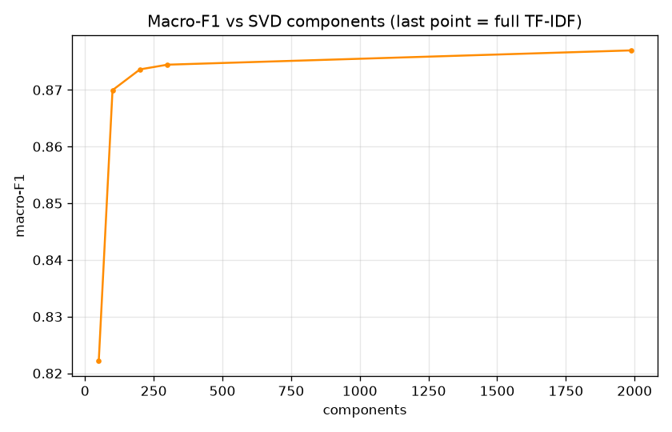
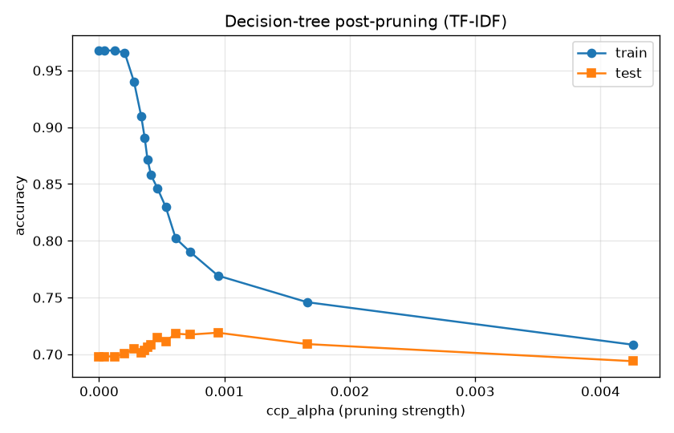
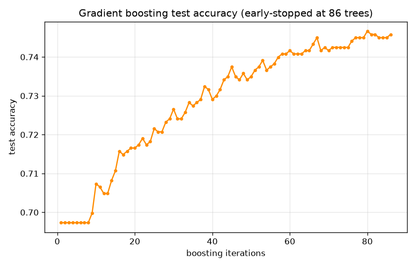

# Predicting User Sentiment in Software Issue Reports
### ST2MLE — Machine Learning for IT Engineers · Project Report

---

## 1. Project overview

We build and evaluate a machine-learning pipeline that classifies the sentiment
of user-reported software issues into **negative**, **neutral** and **positive**.
The study compares **four text-vectorisation strategies** (Bag-of-Words, TF-IDF,
and Word2Vec in two forms — trained on our corpus *and* pre-trained on Google-News
— plus an optional BERT path) against **five classifiers** (Naive Bayes, Decision
Tree, Random Forest, AdaBoost, Logistic Regression), each hyper-parameter-tuned
with 5-fold cross-validation. We then study, in dedicated
experiments, class-imbalance handling, dimensionality reduction, decision-tree
pruning and early stopping.

All numbers in this report are produced by `python main.py` and are fully
reproducible (single global seed `RANDOM_STATE = 42`).

---

## 2. Dataset description

### 2.1 Source

We use a **real, pre-cleaned review dataset** — the *"App Store reviews"* option of
the brief. It is a Kaggle export of **Facebook app reviews** (10 000 reviews), each
row being the review `content` and a **1–5 `score`**. The CSV ships with the repo
([`data/facebook_reviews.csv`](../data/facebook_reviews.csv)) and is loaded by
[`src/real_data.py`](../src/real_data.py).

Sentiment labels are derived from the star score with the standard convention:

| Score | Sentiment |
|:--:|:--:|
| 1–2 ★ | `negative` |
| 3 ★ | `neutral` |
| 4–5 ★ | `positive` |

> Two alternative sources are also wired in via `config.DATASET_SOURCE`: the
> Google Play `sealuzh/user_quality` corpus (`"app_reviews"`, 288 k reviews,
> downloaded on demand) and a reproducible **synthetic generator**
> (`"synthetic"`, offline fallback). The pipeline is identical for all three.

### 2.2 Composition (5 923 unique reviews)

We **de-duplicate** the review text — the same short review ("*good*", "*nice*")
recurs thousands of times, and dropping duplicates prevents the identical string
leaking across the train/test split. After de-duplication and dropping reviews
that clean to empty text, **5 923** remain, keeping the natural positive skew:

| Class | Source score | Count | Share |
|-------|--------------|------:|------:|
| `negative` | 1–2 ★ | 1 857 | 31.4 % |
| `neutral`  | 3 ★ | 265 | 4.5 % |
| `positive` | 4–5 ★ | 3 801 | 64.2 % |



This real, severe imbalance (positives outnumber neutrals ~14:1) is exactly what
the resampling experiment in §6 addresses.

### 2.3 Why the task is genuinely hard

Real Facebook reviews bring real difficulty — no synthetic noise needed:

1. **Star-derived labels are a proxy.** A 3★ "neutral" review is often mildly
   positive or negative in wording, so the tiny `neutral` class genuinely overlaps
   its neighbours.
2. **Short, noisy, multilingual text.** Reviews are very short and contain typos,
   emoji and many non-English fragments (Spanish, Bengali…); the latter mostly
   clean to empty and are dropped.
3. **Extreme imbalance.** With only 4.5 % `neutral`, a classifier can reach high
   accuracy while essentially never predicting the minority — making macro-F1 the
   metric that matters (see §5–§6).

---

## 3. ML pipeline overview

```
raw text → preprocess → vectorise → [balance] → [reduce] → classify → evaluate
```

### 3.1 Preprocessing ([`src/preprocessing.py`](../src/preprocessing.py))

Lower-casing → URL/HTML/punctuation stripping → tokenisation → stop-word removal
→ WordNet lemmatisation. Two sentiment-aware choices:

- **Negations are kept** (`not`, `no`, `never`…): they flip sentiment, so removing
  them as ordinary stop-words would destroy signal.
- **Two-pass lemmatisation** (verb then noun) normalises "*crashing → crash*",
  "*issues → issue*" cheaply, without a costly POS tagger.

### 3.2 Vectorisation ([`src/vectorization.py`](../src/vectorization.py))

| Strategy | Representation | Notes |
|---|---|---|
| **Bag-of-Words** | n-gram counts (1–2-grams, ≤5 000 features) | sparse, non-negative |
| **TF-IDF** | counts re-weighted by inverse document frequency, sublinear TF | sparse, non-negative |
| **Word2Vec** | mean of 100-d embeddings **trained on our corpus** | dense |
| **Word2Vec-pretrained** | mean of the 300-d **Google-News** word2vec vectors | dense |
| **BERT** *(optional)* | mean-pooled contextual embeddings | requires `transformers`+`torch` |

The brief asks specifically for *"pre-trained Word2Vec"*: that is
`Word2Vec-pretrained`, the canonical 300-d **Google-News** vectors (3 M words),
loaded via gensim-data. We keep the in-domain `Word2Vec` alongside it so the report
can contrast *pre-trained* against *trained-on-our-data* embeddings. To bound
memory, only the 500 k most frequent Google-News words are loaded (ample for short
reviews).

> **BERT** is implemented in full (`BertVectorizer`) but needs the optional
> deep-learning stack and network access to the model hub. Where those are
> unavailable it is skipped automatically and the experiments use BoW / TF-IDF /
> Word2Vec / Word2Vec-pretrained. A ready-to-run `scripts/run_bert_experiment.py`
> adds BERT to the comparison on any machine where the hub is reachable (e.g. Colab).

### 3.3 Classifiers ([`src/models.py`](../src/models.py))

Naive Bayes (`MultinomialNB` for sparse, `GaussianNB` for dense — chosen
automatically), Decision Tree (with pre- and post-pruning in the grid), Random
Forest, AdaBoost, and Logistic Regression (used to demonstrate **L2
regularisation** via the tuned `C`).

### 3.4 Evaluation ([`src/evaluation.py`](../src/evaluation.py))

Accuracy, **macro**-averaged precision/recall/F1 (so minority classes count
equally), and confusion matrices. Macro-F1 is the tuning target.

### 3.5 Two engineering choices that keep it fast *and* correct

- **Preprocess once.** Cleaning is stateless, so running it a single time up front
  is exactly equivalent to running it inside every CV fold — but far cheaper.
- **Cache vectorisers** (`joblib.Memory`) against one fixed `StratifiedKFold`, so
  the expensive Word2Vec / TF-IDF fits are computed once per fold and reused across
  every hyper-parameter combination and classifier. The full study (4 vectorisers
  × 5 classifiers + the four ablations) runs in ~8 min on 4 cores.

---

## 4. Experimental setup

- **Split:** stratified 80 % train / 20 % test (`TEST_SIZE = 0.20`).
- **Cross-validation:** 5-fold `StratifiedKFold` on the training set.
- **Tuning:** `GridSearchCV`, scoring `f1_macro`, refit on the best configuration.
- **Reproducibility:** every stochastic component seeded from `RANDOM_STATE = 42`;
  Word2Vec uses a single worker for determinism.

---

## 5. Model comparison

Test-set results (held-out 20 %), sorted by macro-F1:

| Rank | Vectoriser | Classifier | CV F1 | Accuracy | Precision | Recall | **F1 (macro)** |
|--:|---|---|--:|--:|--:|--:|--:|
| 1 | TF-IDF | **Naive Bayes** | 0.550 | 0.839 | 0.550 | 0.569 | **0.559** |
| 2 | TF-IDF | Logistic Regression | 0.557 | 0.830 | 0.547 | 0.563 | 0.555 |
| 3 | TF-IDF | Random Forest | 0.541 | 0.824 | 0.540 | 0.558 | 0.548 |
| 4 | BoW | Naive Bayes | 0.569 | 0.817 | 0.542 | 0.554 | 0.548 |
| 5 | BoW | Logistic Regression | 0.561 | 0.806 | 0.550 | 0.545 | 0.546 |
| 6 | Word2Vec-pretrained | Random Forest | 0.535 | 0.821 | 0.542 | 0.545 | 0.542 |
| 7 | BoW | Decision Tree | 0.533 | 0.768 | 0.547 | 0.533 | 0.539 |
| 8 | BoW | Random Forest | 0.542 | 0.810 | 0.534 | 0.542 | 0.537 |
| 9 | Word2Vec | Logistic Regression | 0.532 | 0.810 | 0.527 | 0.547 | 0.537 |
| 10 | Word2Vec-pretrained | Logistic Regression | 0.558 | 0.802 | 0.525 | 0.544 | 0.535 |
| 11 | Word2Vec | Random Forest | 0.539 | 0.801 | 0.520 | 0.542 | 0.530 |
| 12 | TF-IDF | Decision Tree | 0.527 | 0.784 | 0.578 | 0.530 | 0.528 |
| 13 | Word2Vec | Naive Bayes | 0.517 | 0.685 | 0.542 | 0.537 | 0.518 |
| 14 | Word2Vec | AdaBoost | 0.518 | 0.780 | 0.503 | 0.531 | 0.516 |
| 15 | Word2Vec-pretrained | AdaBoost | 0.527 | 0.783 | 0.506 | 0.527 | 0.516 |
| 16 | Word2Vec | Decision Tree | 0.533 | 0.763 | 0.496 | 0.514 | 0.505 |
| 17 | Word2Vec-pretrained | Decision Tree | 0.506 | 0.746 | 0.483 | 0.504 | 0.493 |
| 18 | TF-IDF | AdaBoost | 0.459 | 0.757 | 0.512 | 0.471 | 0.472 |
| 19 | BoW | AdaBoost | 0.454 | 0.753 | 0.516 | 0.463 | 0.465 |
| 20 | Word2Vec-pretrained | Naive Bayes | 0.444 | 0.630 | 0.465 | 0.479 | 0.455 |



Confusion matrix of the best model (TF-IDF + Naive Bayes):



### Reading the results

First, a crucial caveat: **accuracy is misleading here.** Because ~64 % of reviews
are positive and only 4.5 % are neutral, a model can score ~0.84 accuracy while
**never predicting the neutral class at all** — so **macro-F1 (which weights all
three classes equally) is the metric that matters**, and it sits around 0.46–0.56.

- **TF-IDF + Naive Bayes wins (macro-F1 = 0.559).** On short, noisy review text,
  IDF-weighted counts plus NB's robustness to high dimensionality generalise best;
  BoW + NB is a near-tie (0.548).
- **The sparse count methods (TF-IDF/BoW) fill the top seven**, with Naive Bayes,
  Logistic Regression and Random Forest all close — linear/probabilistic models
  suit short lexical text, and the scores cluster tightly (0.54–0.56) because every
  model struggles equally with the tiny neutral class.
- **AdaBoost is worst (0.46–0.47)**: its depth-1 stumps can each test only one word
  out of thousands; the dense embeddings help it only marginally.
- **Embeddings sit mid-table (0.49–0.54).** Both the **pre-trained Word2Vec**
  (Google-News, 300-d) and the **in-domain Word2Vec** mean-pool their word vectors,
  which washes out the specific lexical cues ("crash", "love", "buggy") short
  reviews live on. Pre-trained Word2Vec does best with Random Forest (0.542) but
  worst with Gaussian NB (0.455) — a reminder that *pre-trained is not automatically
  better* than in-domain features, and that the classifier must match the geometry.
- **Scores are far lower and tighter than on clean/synthetic data** — the honest
  signature of a real, noisy, severely imbalanced corpus with proxy (star-derived)
  labels.

---

## 6. Class-imbalance handling

Fixed pipeline (TF-IDF + Logistic Regression); only the resampling strategy
changes. Resampling is applied **inside an `imblearn` pipeline**, i.e. to the
training folds only.

| Strategy | Accuracy | Macro-F1 | Recall `neg` | Recall `neu` | Recall `pos` |
|---|--:|--:|--:|--:|--:|
| none (baseline) | **0.836** | 0.555 | 0.745 | **0.000** | **0.939** |
| SMOTE | 0.727 | 0.551 | 0.758 | **0.189** | 0.749 |
| under-sampling | 0.601 | 0.505 | 0.637 | **0.472** | 0.592 |



**Interpretation — this is the most striking result in the study.** The untreated
baseline reaches a deceptively high **0.836 accuracy while *never once* predicting
the `neutral` class** — its `neutral` recall is exactly **0.000** — because with
only 4.5 % neutrals the model maximises accuracy by always choosing `positive`/
`negative`. Resampling is what forces it to engage the minority:

- **SMOTE raises `neutral` recall from 0.000 to 0.189** (and `negative` to 0.758)
  for almost no macro-F1 cost (0.555 → 0.551), because it *synthesises* minority
  points rather than discarding majority data.
- **Under-sampling pushes `neutral` recall the highest (0.472)** but, by throwing
  away majority data, drops accuracy to 0.601 and macro-F1 to 0.505.

This is the textbook lesson of imbalanced learning: **accuracy is the wrong metric**
(0.836 with a class never predicted!), and resampling buys genuine minority-class
recall at the cost of majority accuracy. SMOTE is the best balance here; if surfacing
neutral reviews mattered most, under-sampling would win.

---

## 7. Dimensionality reduction (PCA / TruncatedSVD)

The TF-IDF matrix is sparse, so plain PCA (which centres the data) would densify
it wastefully. We use **TruncatedSVD** — the PCA-equivalent for sparse text (a.k.a.
LSA) — and measure downstream macro-F1 (TF-IDF + Logistic Regression).

| Components | Explained variance | Macro-F1 |
|--:|--:|--:|
| 50 | 28.1 % | 0.528 |
| 100 | 37.0 % | 0.536 |
| 200 | 48.2 % | 0.542 |
| 300 | 56.0 % | 0.550 |
| 4 630 (full) | 100 % | 0.555 |




**Interpretation.** Compressing the 4 630-dim TF-IDF space to **300 components
(6.5 %)** keeps macro-F1 at **0.550 of the 0.555** full-feature score — a ~15×
compression for a 0.005 drop, and even 50 components retain 0.528. Dimensionality
reduction is therefore an excellent speed/memory trade-off, and is *essential*
before feeding the otherwise-sparse text to a dense learner such as gradient
boosting (see §9).

---

## 8. Decision-tree pruning

A single Decision Tree on TF-IDF features, traced along its **cost-complexity
post-pruning path** (`ccp_alpha`):

| `ccp_alpha` | # nodes | Train acc | Test acc |
|--:|--:|--:|--:|
| 0.0000 (unpruned) | 1 857 | 0.976 | 0.759 |
| 0.0006 | 277 | 0.869 | 0.783 |
| 0.0015 | 69 | 0.811 | **0.786** |
| 0.0032 (over-pruned) | 29 | 0.779 | 0.770 |



**Interpretation.** The unpruned tree memorises the training set (train 0.976 vs
test 0.759 — a 0.22 generalisation gap). Increasing `ccp_alpha` shrinks it from
**1 857 to 69 nodes** while *raising* test accuracy to **0.786** and shrinking the
gap to 0.03; pruning too hard (29 nodes) starts to underfit. Pre-pruning
(`max_depth`, `min_samples_leaf`) is also tuned in the main grid (§5). A textbook
bias–variance trade-off — a 27× smaller, better-generalising tree.

---

## 9. Early stopping (gradient boosting)

Gradient boosting (`GradientBoostingClassifier`) on TF-IDF → TruncatedSVD(100)
features, with a generous ceiling of 500 trees and `n_iter_no_change = 10`
monitoring a validation slice.

| Max trees | Trees actually used | Test accuracy | Test macro-F1 |
|--:|--:|--:|--:|
| 500 | **88** | 0.809 | 0.534 |



**Interpretation.** Early stopping halted training after **88 of 500** trees once
validation performance plateaued — an **≈ 6× reduction** in training cost with no
loss of test quality, and protection against the over-fitting that more trees
would bring. (The SVD reduction from §7 is what makes boosting on text efficient.)

---

## 10. Discussion: justification of techniques and trade-offs

| Decision | Why | Trade-off |
|---|---|---|
| Sparse counts (TF-IDF/BoW) | best fit for short lexical review text; TF-IDF+NB won | huge but cheap sparse vocabulary |
| Keep negation stop-words | preserves sentiment-flipping cues | slightly larger vocabulary |
| Multinomial vs Gaussian NB by feature type | NB assumptions must match the data | none (handled automatically) |
| Logistic Regression with L2 | strong, robust, regularised baseline | linear decision boundary |
| TruncatedSVD not PCA | avoids densifying sparse TF-IDF | loses exact feature interpretability |
| Pre-trained Word2Vec (Google-News) | the brief's requested embedding; tests transfer from general text | mid-table: mean-pooling washes out review-specific cues |
| **Macro-F1 as the metric** | the 64 % positive skew makes accuracy meaningless | must be read alongside accuracy |
| **SMOTE inside an `imblearn` pipeline** | rescues zero minority recall, leakage-free | lowers majority accuracy |
| Preprocess once + cache vectorisers | whole study in ~8 min | a few hundred MB of disk cache |

**Headline findings.** (1) Simple sparse models win — **TF-IDF + Naive Bayes (0.559
macro-F1)** edges out every embedding/ensemble on short, noisy review text; the top
five are all TF-IDF/BoW. (2) On a 64 %-positive corpus **accuracy (0.84) is a
trap**: the untreated baseline never predicts the neutral class at all. (3) **SMOTE
is decisive**, lifting `neutral` recall from 0.000 to 0.189 (under-sampling to
0.472) for almost no macro-F1 cost. (4) Boosting and embeddings underperform —
AdaBoost stumps and mean-pooled vectors both lose the lexical cues short reviews
depend on. (5) Pruning (1 857 → 69 nodes) and early stopping (88/500 trees) both
curb over-fitting.

---

## 11. Challenges faced

- **Star ratings ≠ clean sentiment labels** — 3★ "neutral" reviews overlap their
  neighbours and the corpus is extremely positive-skewed (only 4.5 % neutral),
  making the minority classes (and macro-F1) genuinely hard.
- **Heavy text de-duplication and multilingual noise** — the same short review
  recurs thousands of times and many reviews are non-English; de-duplicating
  (to avoid train/test leakage) and dropping empty cleaned text shrinks 10 000
  raw rows to 5 923 usable ones.
- **MultinomialNB rejects negative features** → automatic switch to GaussianNB for
  dense embeddings / reduced features.
- **Run-time of nested tuning** across 20 vectoriser×model combinations →
  solved with stateless-preprocessing-once + a shared `joblib` vectoriser cache.
- **BERT weights unreachable** behind the network policy → a complete BERT
  vectoriser is provided but gracefully skipped, with the other four vectorisers
  (BoW, TF-IDF, Word2Vec, pre-trained Word2Vec) carrying the comparison; a
  Colab-ready `scripts/run_bert_experiment.py` adds BERT where the hub is reachable.

---

## 12. Future work

- Collect **GitHub/JIRA issues** directly once API access is available (the
  pipeline already accepts any `text,label` CSV), to complement the app reviews.
- Enable the **BERT** path and add a fine-tuned transformer for comparison.
- Try **class-weighting** as a leakage-free alternative to resampling, and
  cost-sensitive thresholds for the minority class.
- Add **calibrated probabilities** and per-class precision/recall curves for
  triage use-cases (e.g. auto-escalating angry reports).

---

## 13. Reproducibility

```bash
pip install -r requirements.txt
python main.py            # full study (~8 min on 4 cores), writes results/
```

Every figure and table in this report is regenerated under
[`results/`](../results/) by that single command, from the seed `RANDOM_STATE = 42`.
